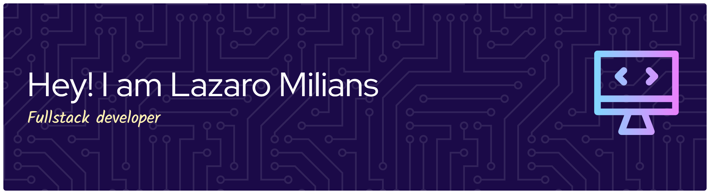

# 💫 About Me:
I build SME management solutions—ERP, e-invoicing, inventory & sales—across LATAM. My stack is Java/Spring Boot, Angular, and PostgreSQL, usually in a microservices setup. I’m obsessed with performance, clean boundaries, and reliability: secure auth (JWT/SSO), CI/CD, and observable systems.  🔭 Current focus: ERP modules (Purchasing, Inventory, Accounting, Cash/Banks) + e-invoicing (UY/EC).  🛠️ Tech: Spring Boot · Angular · PostgreSQL · Docker · REST APIs · GitHub Actions.  📈 Interests: performance tuning, DDD-lite, testing strategies, logs/traces.  🤝 Open to: B2B projects, technical consulting, and partnerships.

## 🌐 Socials:
   

# 💻 Tech Stack:
                                         
# 📊 GitHub Stats:
 
 

---

<!-- Proudly created with GPRM ( https://gprm.itsvg.in ) -->
